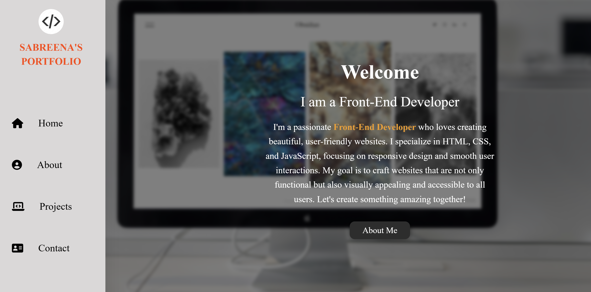
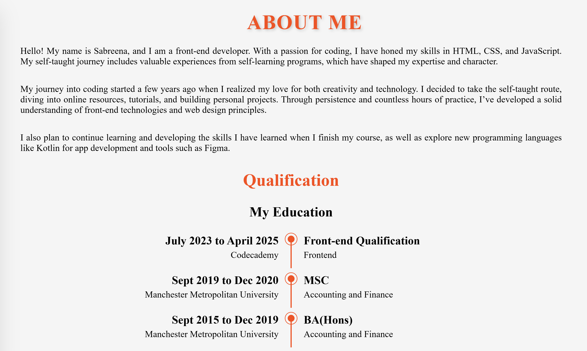
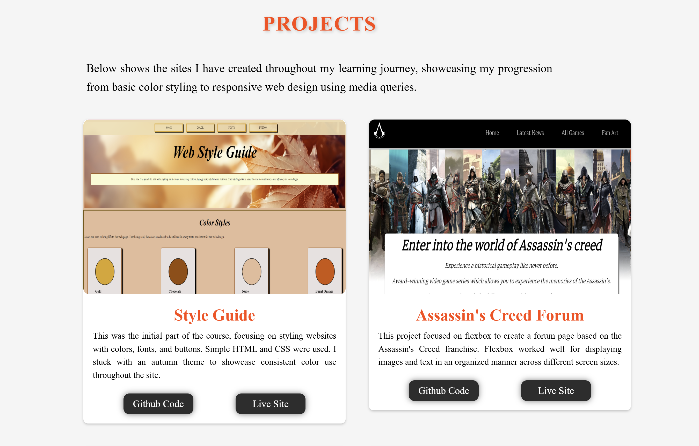
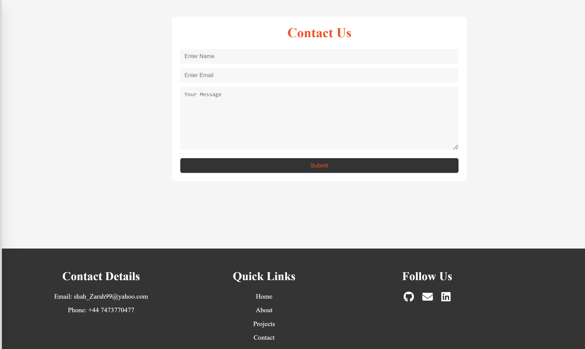
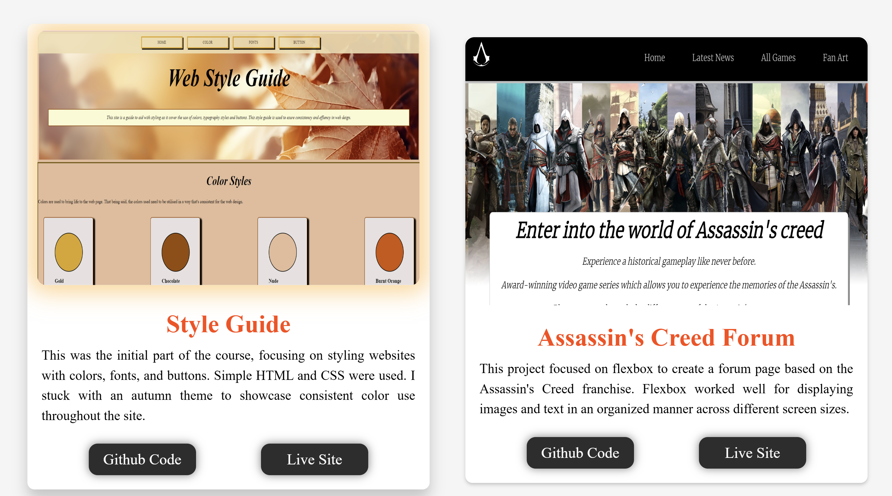
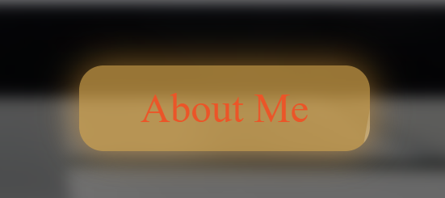

# Welcome To My Portfolio

This is an overview for my portfolio. 

This project is a visually appealing web layout using HTML and CSS. It features responsive design, interactive card elements with hover effects, and a modern button with a glowing shine effect. The layout is designed to adapt to various screen sizes, making it mobile-friendly.

## Demo

## Features
- **Responsive Design**: The layout adjusts for multiple screen sizes, ensuring a seamless experience on desktops, tablets, and mobile devices.
- **Card Hover Effects**: Cards have hover animations with zoom-out effects and a glowing box shadow for an interactive user experience.

- **Modern Button Styling**: Buttons have a hover shine effect and smooth transitions, enhancing the look and feel of the page.

- **Typography & Design**: Custom fonts, letter-spacing, and text-shadow effects for titles. Content is neatly aligned with justifiable text for better readability.
- **Animations**: Subtle animations like a pulse glow on image hover and smooth transitions for interactive elements.

## Technologies Used
- **HTML**: Basic structure for the page.
- **CSS**: Styling for the page, including layout, typography, and interactive effects.

## Live Site
Visit the live demo: https://sabkaz78614.github.io/personal-portfolio/

